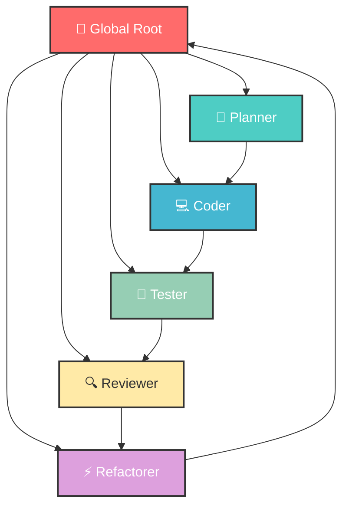

<div align="center">

<!-- Animated Header Banner -->


<!-- Badges -->
<p align="center">
  
  
  
  
</p>

<!-- Animated Tagline -->
<p align="center">
  
</p>

<!-- Quick Links -->
<p align="center">
  <a href="#-quick-start">🚀 Quick Start</a> •
  <a href="#-architecture">🏗️ Architecture</a> •
  <a href="#-features">✨ Features</a> •
  <a href="#-research">📚 Research</a>
</p>

</div>

---

## 📋 Overview



**Kimi Global Agent Team** transforms Kimi Code CLI into a structured AI engineering organization. Inspired by cutting-edge multi-agent research and modern prompt engineering techniques, this system delivers production-grade code through collaborative agent orchestration.

---

## 🚀 Quick Start

### Prerequisites

- Kimi Code CLI installed
- Bash-compatible terminal
- Git

### Installation

<details open>
<summary><b>⚡ One-Line Install</b></summary>

```bash
curl -fsSL https://raw.githubusercontent.com/YOUR_USERNAME/kimi-global-agent-team/main/install.sh | bash
```

</details>

<details>
<summary><b>📦 Manual Installation</b></summary>

```bash
# 1. Clone the repository
git clone https://github.com/YOUR_USERNAME/kimi-global-agent-team.git
cd kimi-global-agent-team

# 2. Make installer executable
chmod +x install.sh

# 3. Run installer
./install.sh

# 4. Reload shell configuration
source ~/.bashrc  # or ~/.zshrc

# 5. Launch the agent system
kimi-team
```

</details>

---

## 🏗️ Architecture

<div align="center">

| Agent | Role | Responsibilities |
|:-----:|:----:|:-----------------|
| 🎯 **Global Root** | Orchestrator / Manager | Task delegation, workflow coordination, final output assembly |
| 📐 **Planner** | System Architect | High-level design, technical specifications, architecture planning |
| 💻 **Coder** | Implementation Engineer | Code generation, feature implementation, bug fixes |
| 🧪 **Tester** | QA & Test Generator | Unit tests, integration tests, test coverage analysis |
| 🔍 **Reviewer** | Code Reviewer & Security | Security audits, code quality checks, best practices enforcement |
| ⚡ **Refactorer** | Optimization & Cleanup | Performance optimization, code cleanup, technical debt reduction |

</div>

### Delegation Flow

```
┌─────────────────────────────────────────────────────────────────┐
│                         WORKFLOW PIPELINE                        │
├─────────────────────────────────────────────────────────────────┤
│                                                                  │
│   ┌──────────┐    ┌──────────┐    ┌──────────┐    ┌──────────┐  │
│   │  INPUT   │───▶│ PLANNER  │───▶│  CODER   │───▶│  TESTER  │  │
│   └──────────┘    └──────────┘    └──────────┘    └────┬─────┘  │
│                                                        │        │
│   ┌──────────┐    ┌──────────┐    ┌──────────┐         │        │
│   │  OUTPUT  │◀───│ REFACTOR │◀───│ REVIEWER │◀────────┘        │
│   └──────────┘    └──────────┘    └──────────┘                  │
│                                                                  │
└─────────────────────────────────────────────────────────────────┘
```

### Core Tools

| Tool | Purpose |
|------|---------|
| `Task` | Synchronous task execution and result tracking |
| `CreateSubagent` | Dynamic agent spawning for specialized tasks |
| `Read/Edit` | File system operations with context awareness |
| `Shell` | Command execution and environment management |

---

## ✨ Features

<div align="center">

<table>
<tr>
<td width="50%">

### 🧠 Intelligent Planning
- **Chain-of-Thought** reasoning
- **Tree-of-Thoughts** exploration
- Multi-step task decomposition
- Context-aware decision making

</td>
<td width="50%">

### 🔒 Security First
- Automated security audits
- Injection testing
- Secrets detection
- Compliance checking

</td>
</tr>
<tr>
<td width="50%">

### ⚙️ Dynamic Orchestration
- Runtime agent creation
- Adaptive task routing
- Self-verification loops
- Error recovery mechanisms

</td>
<td width="50%">

### 📊 Structured Output
- JSON schema validation
- Deterministic generation
- Type-safe responses
- Consistent formatting

</td>
</tr>
</table>

</div>

---

## 💡 Example Usage

### Building a Production REST API

```bash
$ kimi-team

🎯 Global Root: "Build a production-ready Express REST API with JWT authentication"
```

**Expected Workflow:**

```
✅ Phase 1: Planning
   └─ 📐 Planner analyzes requirements
   └─ 📐 Planner designs architecture
   └─ 📐 Planner creates technical specification

✅ Phase 2: Implementation  
   └─ 💻 Coder generates Express boilerplate
   └─ 💻 Coder implements JWT middleware
   └─ 💻 Coder creates route handlers

✅ Phase 3: Testing
   └─ 🧪 Tester writes unit tests
   └─ 🧪 Tester creates integration tests
   └─ 🧪 Tester validates coverage

✅ Phase 4: Review
   └─ 🔍 Reviewer checks security
   └─ 🔍 Reviewer validates best practices
   └─ 🔍 Reviewer approves changes

✅ Phase 5: Optimization
   └─ ⚡ Refactorer optimizes performance
   └─ ⚡ Refactorer cleans up code

🎉 Final Output: Production-ready API delivered!
```

---

## 📚 Research Foundations

<div align="center">

| Research Paper | Authors | Year | Link |
|:--------------|:--------|:----:|:----:|
| **Chain-of-Thought Prompting** | Wei et al. | 2022 | [arXiv](https://arxiv.org/abs/2201.11903) |
| **Tree-of-Thoughts** | Yao et al. | 2023 | [NeurIPS](https://arxiv.org/abs/2305.10601) |
| **Structured Prompting & Self-Verification** | Prompt Engineering Survey | 2024 | [arXiv](https://arxiv.org/abs/2407.05437) |
| **Multi-Agent Engineering Pattern** | Oh-My-OpenCode | — | [GitHub](https://github.com/code-yeongyu/oh-my-opencode) |

</div>

---

## ⚙️ Configuration

### Best Practices

```yaml
# Recommended Settings
model: kimi-for-coding
thinking_mode: enabled
temperature:
  coder: 0.1      # Low for deterministic code
  tester: 0.1     # Low for consistent tests
  planner: 0.3    # Slightly higher for creativity
  reviewer: 0.2   # Balanced for thorough analysis
```

### Tips for Optimal Performance

> 💡 **Pro Tip:** Let the root agent orchestrate — avoid manually forcing subagents. The system is designed for autonomous delegation.

- ✅ Use `kimi-for-coding` model for best results
- ✅ Enable thinking mode for complex tasks
- ✅ Keep temperature low for code generation agents
- ✅ Allow the orchestrator to manage the workflow
- ✅ Provide clear, detailed requirements

---

## 🗺️ Roadmap

<div align="center">

| Status | Feature | Description |
|:------:|:--------|:------------|
| ✅ | Core Multi-Agent System | 6 specialized agents with defined roles |
| ✅ | Dynamic Subagent Creation | Runtime agent spawning |
| ✅ | Security Framework | Automated security checks |
| 🚧 | Memory Layer | Persistent context across sessions |
| 🚧 | Autonomous Orchestration | Self-directed recursive workflows |
| 📋 | CI Integration | GitHub Actions / GitLab CI support |
| 📋 | Auto Bootstrap | Project initialization mode |

</div>

---

## 🤝 Contributing

Contributions are welcome! Please feel free to submit a Pull Request.

```bash
# Fork the repository
git clone https://github.com/YOUR_USERNAME/kimi-global-agent-team.git

# Create your feature branch
git checkout -b feature/amazing-feature

# Commit your changes
git commit -m 'Add amazing feature'

# Push to the branch
git push origin feature/amazing-feature

# Open a Pull Request
```

---

## 📄 License

<div align="center">

[](LICENSE)

**MIT License** — feel free to use this project for personal or commercial purposes.

</div>

---

<div align="center">

<!-- Footer Banner -->


<!-- Social Links -->
<p>
  <a href="https://github.com/YOUR_USERNAME">
    
  </a>
  <a href="https://twitter.com/YOUR_HANDLE">
    
  </a>
  <a href="mailto:your.email@example.com">
    
  </a>
</p>

<!-- Made With Love -->
<p>
  
  
</p>

**⭐ Star this repo if you find it helpful!**

</div>
